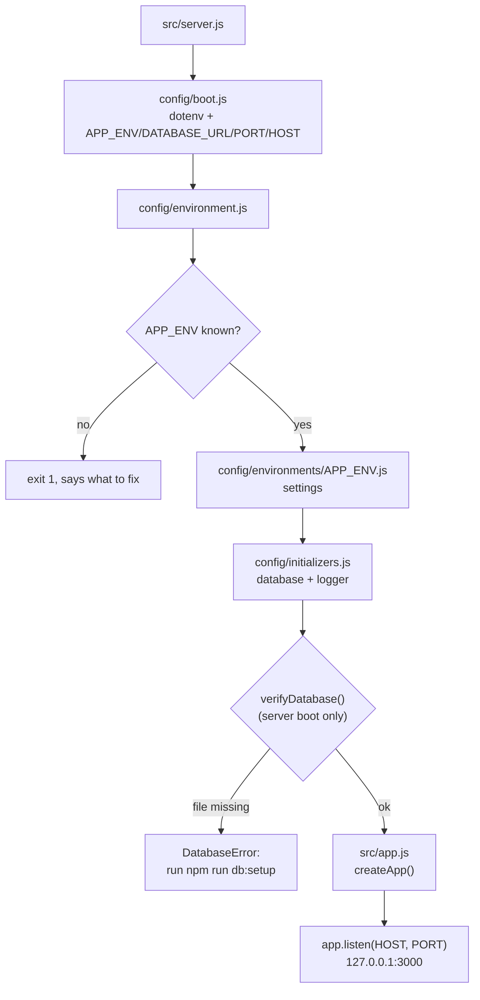

# Architecture

How the server boots and how a request travels through it. This is the Node.js
port of [`ruby-sinatra`'s architecture](../../ruby-sinatra/docs/architecture.md):
same layout of responsibilities, same contract. The entities are in
[resources/](resources/) and the error contract in [errors.md](errors.md).

## Stack

| Concern | Choice |
| --- | --- |
| Runtime | Node.js >= 20 (CI matrix: 20, 22, 24) |
| Web | Express 5 |
| ORM | Prisma 6 (SQLite) |
| Password hashing | `bcryptjs` (cost 10, same digest format as the original) |
| Logger | Pino (structured JSON on stdout) |
| Tests | Jest + Supertest |

## Layout

| Path | Responsibility |
| --- | --- |
| `src/server.js` | Entry point: loads the environment, verifies the database, listens |
| `config/boot.js` | Loads `.env`; defines `PROJECT_ROOT`, resolves `APP_ENV`, `DATABASE_URL`, `PORT`, `HOST` |
| `config/environment.js` | Refuses an unknown `APP_ENV`, loads settings and initializers |
| `config/environments/*.js` | Settings per environment (`logLevel`, `requestLogging`) |
| `config/initializers/` | `database` (shared Prisma Client + check) and `logger` (shared Pino instance) |
| `src/app.js` | Express app factory: middleware, health route, routers, error handlers |
| `src/routes/<resource>.js` | One router per resource (`users`, `products`, `payments`) |
| `src/models/<resource>.js` | Validation rules, JSON shape (`toJson`), Prisma mapping (`buildData`), transitions |
| `src/helpers/` | `json` (body), `records` (lookup/attributes/persistence), `params` (query parameters) |
| `src/middleware/` | `raw-body` (64 KB limit) and `request-logger` (per-request lines) |
| `lib/errors/errors.js` | `HttpError`, the route table (404/405) and the JSON error handler |
| `prisma/schema.prisma` | Data model: `User`, `Product`, `Payment` (same tables/columns as the original) |
| `prisma/migrations/` | SQLite DDL, generated by Prisma Migrate |
| `test/models/`, `test/routes/` | Model and request specs, one file per resource, mirroring `src/` |
| `contract/` | Machine-readable contracts: `openapi.yml` and `database.sql` |

## Boot

- `APP_ENV` selects environment, settings and database (`development`, `test`
  or `production`); an unknown value stops the boot with the fix in the
  message (`config/environment.js`).
- The database check runs on **server boot only** (`src/server.js`), never
  from the migrate/seed scripts or the tests — the counterpart of the Rake
  exclusion in the original: those create the file themselves.
- The tests build the app directly (`createApp()`) with `APP_ENV=test` and
  manage the database themselves, skipping `config/environment.js`.
- A startup failure (`DatabaseError`) is printed on its own, without a stack
  trace, and exits with status 1.

## Request lifecycle

In order, top to bottom. What each stage answers with lives in
[errors.md](errors.md).

| Stage | File |
| --- | --- |
| Body: size limit (64 KB) and raw capture | `src/middleware/raw-body.js` |
| Body: JSON shape (must be an object) | `src/helpers/json.js` |
| Fields: allowlist of the resource | `src/helpers/records.js` |
| Query parameters: pagination, sorting, filters | `src/helpers/params.js` |
| Lookup: id format, then record | `src/helpers/records.js` |
| Validation: model rules (async, may query the database) | `src/models/<resource>.js` |
| Persistence: Prisma (`create` / `update` / `delete` / `updateMany`) | `src/routes/<resource>.js` |
| Response: model's `toJson` allowlist | `src/models/<resource>.js` |

Anything that escapes reaches `errorHandler` in `lib/errors/errors.js`.

## Environments, database and server

- `development`, `test`, `production` — each with its own SQLite file in
  `storage/`, selected by `DATABASE_URL` (`file:../storage/<env>.sqlite3` by
  default, resolved by Prisma from the `prisma/` folder). See `.env.example`.
- Prisma reads the schema in `prisma/schema.prisma`; the migrations in
  `prisma/migrations/` produce the same DDL the original's `db/migrate/`
  does (`contract/database.sql` is the shared contract).

### Database commands

| Command | What it does |
| --- | --- |
| `npm run db:setup` | `migrate dev` + `seed` (first run) |
| `npm run db:migrate` | Create/apply a dev migration from schema changes |
| `npm run db:deploy` | Apply existing migrations (CI / test / production) |
| `npm run db:reset` | Drop, re-migrate and re-seed the current database |
| `npm run db:seed` | Load fixtures (idempotent) |
| `npm run db:generate` | Regenerate the Prisma Client |
| `npm run db:studio` | Open Prisma Studio to browse the data |

- The test suite uses its own file, `storage/test.sqlite3`; `npm test` migrates
  it first (`pretest`) and runs Jest serially (`--runInBand`) — the specs
  share one SQLite file and clean its tables between examples.
- `npm run db:seed` (`db/seeds/`) loads the same fixtures as the original from
  `db/seeds/data/*.yml`, one file per resource, matched by identity (`email`,
  `name`, `amount`), so re-running it never duplicates records.
- The server binds `127.0.0.1:3000` (`PORT`/`HOST` override). The API has no
  authentication; the loopback address is the only thing keeping it private.
- Logging is one shared Pino instance: `debug` in development (every request
  logged), silent when `APP_ENV=test`, `info` in production; `LOG_LEVEL`
  overrides the level (`config/initializers/logger.js`).
